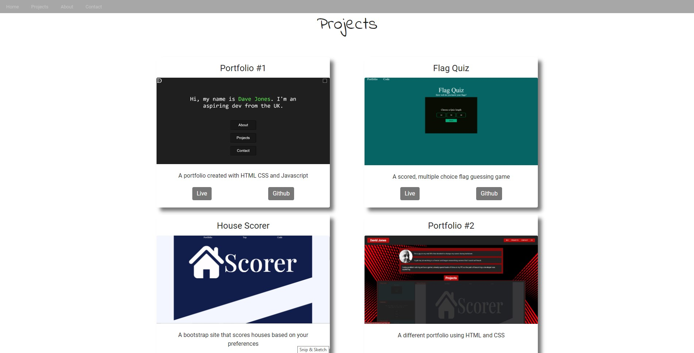
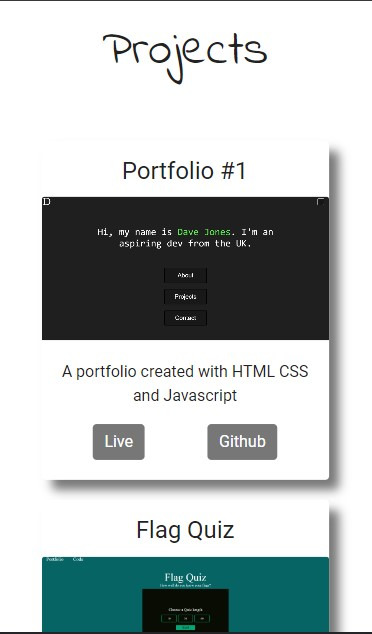
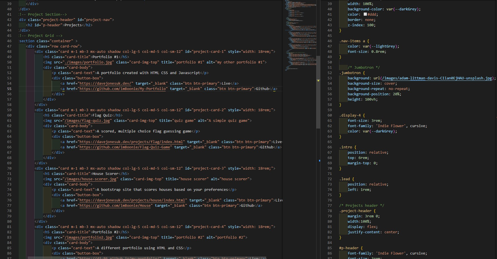

# Bootstrap Portfolio

## My task is to create a responsive bootstrap page showcasing what I have learned so far

“The most popular HTML, CSS, and JS framework for developing responsive, mobile-first projects on the web.”

Bootstrap is a giant collection of handy, reusable bits of code written in HTML, CSS, and JavaScript. It’s also a frontend development framework that enables developers and designers to quickly build fully responsive websites.

## Site & Repo

- [Site](https://dj-86.github.io/bootstrap-portfolio/)
- [Repo](https://github.com/DJ-86/bootstrap-portfolio)

## Resources:

- [Bootstrap](https://getbootstrap.com/)
- [Tutorial](https://www.w3schools.com/bootstrap4/)

## Screenshots

## License

- [MIT](LICENSE.md)
